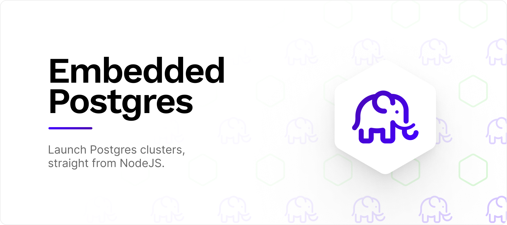

<div align="center">


</div>

<h3 align="center">
    🐘 A Node package that spawns PostgresQL clusters programatically.
</h3>

## Installation
`embedded-postgres` is available from NPM:

```sh
npm i embedded-postgres
```

<br />

## Usage
This package contains a simple API that allows you to create clusters, start
them, create / delete database and stop any existing processes.

```ts
import EmbeddedPostgres from 'embedded-postgres';

async function main() {
    // Create the object
    const pg = new EmbeddedPostgres({
        databaseDir: './data/db',
        user: 'postgres',
        password: 'password',
        port: 5432,
        persistent: true,
    });

    // Create the cluster config files
    await pg.initialise();

    // Start the server
    await pg.start();

    // Create and/or drop database
    await pg.createDatabase('TEST');
    await pg.dropDatabase('TEST');

    // Initialize a node-postgres client
    const client = pg.getPgClient();
    await client.connect();
    const result = await client.query('SELECT datname FROM pg_database');

    // Stop the server
    await pg.stop();
}

main();
```

<br />

## PostgresQL Versions
This package aims to track the [PostgresQL support
policy](https://www.postgresql.org/support/versioning/) for supported versions.
Additionally, we track the binaries that are created upstream in [zonky's
embedded-postgres-binaries](https://github.com/zonkyio/embedded-postgres). This
leads to the following current support matrix:

| Platform / Architecture | 11.20.0 | 12.15.0 | 13.11.0 | 14.8.0 |  15.3.0 |
|---|---|---|---|---|---|
| 🍎 Darwin / x64 |  ✅ |  ✅ |  ✅ |  ✅ |  ✅ |
| 🍎 Darwin / arm64[[1]](https://github.com/zonkyio/embedded-postgres/issues/86#issuecomment-1120425822) | 🚫 |  🚫 |  🚫 |  🚫 |  ✅ |  ✅ |
| 🪟 Windows / x64 |  ✅ |  ✅ |  ✅ |  ✅ |  ✅ |
| 🐧 Linux / x64 |  ✅ |  ✅ |  ✅ |  ✅ |  ✅ |
| 🐧 Linux / arm |  ✅ |  ✅ |  ✅ |  ✅ |  ✅ |
| 🐧 Linux / arm64 |  ✅ |  ✅ |  ✅ |  ✅ |  ✅ |
| 🐧 Linux / ia32 |  ✅ |  ✅ |  ✅ |  ✅ |  ✅ |
| 🐧 Linux / ppc64 |  ✅ |  ✅ |  ✅ |  ✅ |  ✅ |

In order to install a particular version, look for the latest tag in
[NPM](https://www.npmjs.com/package/embedded-postgres). For example, if you
would like to install `v10.20.0`, you can currently use the following tag:
```sh
npm i embedded-postgres@10.20.0-beta.6
```

Installing particular versions of PostgresQL (i.e. versions not released on NPM)
is currently not possible. If you would have a need for doing so, please create
an issue.

<br />

## API
Options in the constructor can be used to modify the behaviour of the
application. The parameters that are available as part of the options can be
seen here:

| Property | Type | Description |
|---|---|---|
| databaseDir | string | The location where the data should be persisted to. Defaults to `./data/db` |
| port | number | The port where the Postgres database should be listening. Defaults to:  `5432` |
| user | string | The username for logging into the Postgres database. Defaults to `postgres` |
| password | string | The password for logging into the Postgres database. Defaults to `password` |
| authMethod | 'scram-sha-256' \| 'password' \| 'md5' | The authentication method to use when authenticating against Postgres. Defaults to `password`  |
| persistent | boolean | Whether all data should be left in place when the database is shut down. Defaults to `true`. |
| initdbFlags | string[] | Pass any additional flags to the initdb process. You can find all available flags here: https://www.postgresql.org/docs/current/app-initdb.html. Flags should be passed as a string array, e.g. `["--debug"]` or `["--locale=en-GB"]`  Defaults to `[]` 
| postgresFlags | string[] | Pass any additional flags to the postgres process. You can find all available flags here: https://www.postgresql.org/docs/current/app-postgres.html. Flags should be passed as a string array, e.g. `["--debug"]` or `["--locale=en-GB"]`. Defaults to `[]`.  |
| createPostgresUser | boolean | Postgres does not allow binaries to be run by root. In case you're running in root-only enviroments, such as Docker containers, you may need to create an extra user on your system in order to be able to call the binaries. <br />NOTE: This WILL irreversibly modify your host system. The effects are somewhat minor, but it's still recommend to only use this in Docker containers. Defaults to `false`. |
| onLog | (message \| string) => void | Pass in a custom logging handler. This will relay and console messages that are generated by the postgres and initdb processes. Defaults to `console.log` |
| onError | (messageOrError \| string \| Error \| unknown) => void | Pass in a custom error logging handler. This will catch and stderr results coming in from the postgres and initdb processes. Defaults to `console.error` |

<br />

## Contributing
This package is open to issues, feedback, ideas and pull requests. Create an
issue on this repository to get started!

<br />

## Troubleshotting

### Running in Docker containers
Running in Docker containers might fail, because many are setup to run with the
root user as default. Either you resolve to setting up a container with a
specific user yourself, or you set the `createPostgresUser` option to true,
after which embedded-postgres will automatically set up a postgres user on the
system for usage by your script.

<br />

## Credits and Licensing
Embedded Postgres was created by Lei Nelissen for [BMD
Studio](https://bmd.studio). It is based on [zonky's
embedded-postgres-binaries](https://github.com/zonkyio/embedded-postgres). The
binaries are made available under the Apache License 2.0, whereas the specific
code in this package is made available under the MIT license.

<a href="https://bmd.studio">
    
</a>

<br />
